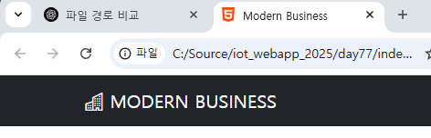
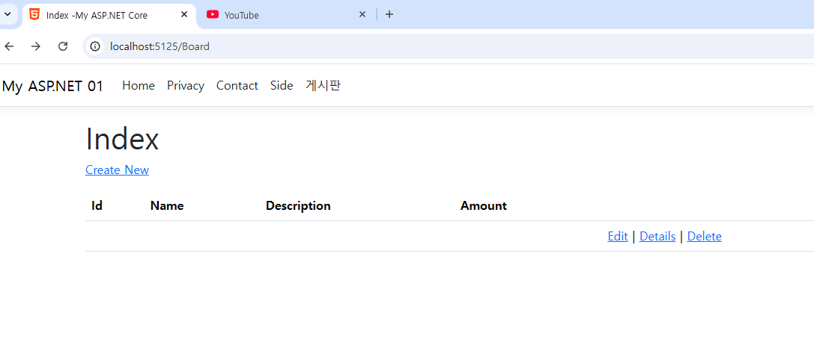
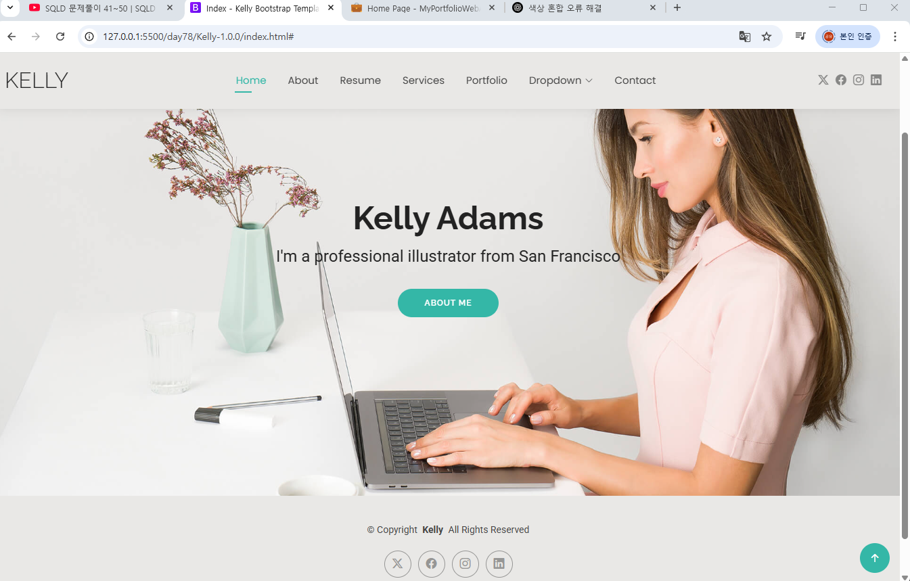
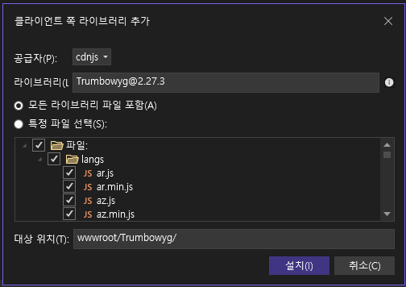

# iot_webapp_2025
iot 개발자 과정 ASP.NET Core 학습 리포지토리
### 이미지 참고 사이트
- [Placehold](https://placehold.co/)
- [Lorem Picsum](https://picsum.photos/)
- [LoremFlickr](https://loremflickr.com/)

## 74일차(5/22)
### Web
- 인터넷 상에 사용되는 서비스 중 하나
- 웹을 표현하는 기술 : HTML, XML의 경량화 버전
- 2014년 이후 HTML5로 적용되고 있음

### 웹 기술
- 웹 표준기술(프론트엔드) : HTML5(웹페이지 구조) + CSS3(디자인) + JavaScript6(인터렉티브)
- 웹 서버기술(백엔드) : ASP.NET Core (C#|VB) , SpringBoot(JAVA) , FLASK|DJANGO(PYTHON) , CGI(PHP, C) , Ruby...
- 웹 서비스 : 프론트엔드 + 백엔드
- 웹 브라우저 상에서 동작 : 현재는 웹 브라우저 상에서만 동작하는 경계가 사라졌음


#### HTML5
- 웹 페이지를 구성하는 언어(근간, 기본)
- HTML 상에서도 디자인을 할 수 있으나, 현재는 CSS로 분리

#### CSS 3
- 객체지향에 사용되는 부모자식 관계로 디자인 하는 기술
- 아주 쉬운 문법으로 구성됨

#### JavaScript
- 표준명 ECMAScript 2024
- Java와 전혀 관계없음. Java의 문법을 차용해서 사용한 웹 스크립트 언어
- 엄청난 발전을 이뤄 여러가지 기술로 분리
    - React.js, View.js 등의 프론트엔트 기술 언어로 분파
    - Node.js와 같은 웹 서비스기술에도 적용
    - VS Code 같은 개발도구를 만드는데도 사용
    - 3D 게임, 모바일 개발 등 다양한 분야에 사용

#### 웹 서버기술
- ASP.NET Core  : C#/VB언어로 웹 서버를 개발
- SpringBoot, Flask 등 다른 언어로 웹 서버를 개발해도 무방

#### 왜 웹을 공부해야하나?
- 스마트팩토리 솔루션ㅇ르 대부분 웹으로 개발(사용범위 제약을 없애기 위해서)
    - 웹 사이트, 일부분 모바일 앱 동시 개발
- 스마트홈(Iot) , ERP, 병원예약, 호텔예약, 인터넷뱅킹, 온라인서점...
- 모든 IT/ICT 개발에 웹 기술은 포함되어 있음

#### HTTP
- 웹을 요청/응답하는 프로토콜
- HTTPs : HTTP with secure . 보안 강화한 HTTP 프로토콜

### 웹 표준기술 학습
#### vs code 확장 설치
- `Live Server`

#### HTML 구조
- html 태그 내에 head, body로 구성
- README.md에도 HTML태그를 그대로 사용가능
- VS Code에서 html 적고 탭눌러서 html:5 자동생성
- css가 소스라인을 많이 사용. css는 외부스타일로 분리해서 사용 [(html)](./day74/html03.html) [(css)](./day74/html03.css)
- js도 소스라인이 매우 김. js도 외부스크립트로 분리 사용 [(html)](./day74/html03.html) [(js)](./day74/html03.js)
- 웹 브라우저의 개발자모드(F12)로 디버깅을 하는 것이 일반적


#### HTML 기본태그(body에 사용) [(html)](./day74/html04.html) [(html 입력태그)](./day74/html05.html)  [(다양한 입력방식)](./day74/html06.html) 
- h1~h6 : 제목글자
- p, br, hr : 본문, 한줄내려가기, 가로줄
- div : 영역구분
- a : 링크
- b/strong, i, small, sub, sup, ins/u, del  : 굵은체, 이탤릭체, 작은글씨, 아래첨자, 위첨자 ,밑줄, 삭제표시밑줄 ...
- ul/ol , li : 동그라미목록/순번목록, 목록아이템
- table, tr, th, td : 테이블, 테이블로우, 테이블헤더, 테이블컬럼
- form, input, button, select, textarea, label : 폼, 폼 입력양식, 버튼, 콤보박스, 여러줄텍스트박스, 라벨
- img , audio, video : 이미지, 오디오, 비디오
- progress : 진행률

#### 공간분할태그 [(div, span 태그)](./day74/html07.html) 
- div 사용 이전엔 table, tr, td로 화면 분할을 활용
- table을 여러번 중복하면 랜더링 속도 저하로 화면이 빨리 표시가 안됨
- 웹 기술표준을 적용해서 div 태그로 공간분할을 시작
- div를 css로 디자인 적용해서 랜더링 속도를 빠르게 변경
- 게시판 목록, 상세보기 등에서는 아직도 table을 사용중

1. div
-
2. span : 인라인 요소(inline element)로, 텍스트나 다른 인라인 요소의 일부를 감싸서 스타일을 적용하거나 자바스크립트로 조작
-

#### 시맨틱웹
- 웹구조를 좀더 구조적으로 세밀하게 구분짓는 의미로 만들어진 웹 구성방식
- 시맨틱 태그
    - header, nav, main, section, aside, article, footer
    - 기본 HTML 태그가 아니고, 필수도 아님
- 최근에는 잘 사용안함. div태그에 id를 부여해서 유사하게 사용 중
- div만 잘 쓰면 됨

### 웹 표준기술 -CSS  [(div태그에 css)](./day74/html08.html)
#### 개요
- 마크업 언어에 표시방법을 기술하는 종속형 시트(계단식 스타일시트)
- WPF는 CSS와 유사한 방식을 차용
- 문법
    ```css
    태크/아이디/클래스 {
        key : value ;  /*한줄주석은 안됨. 여러줄 주석만 됨*/
    }
    ```
- html 태그 속성
    - id :웹페이지 하나당 한번만 쓸 것 , **속성 #**
    - class : 여러번 사용가능 , **속성 .**
    ```html
    <head>
        <style>
            #header 
            {
                background-color: antiquewhite;
            }
            .temp
            {
                background-color: rgb(250, 215, 244);
            }
        </style>

    </head>

    <body>
        <div id="header">
            <h1>로고영역</h1>
        </div>
        <div id="nav" class="temp">
            <ul>
                <li>메일</li>
                <li>카페</li>
                <li>블로그</li>
                <li>스토어</li>
                <li>뉴스</li>
                <li>증권</li>
                <li>부동산</li>
            </ul>
        </div>
        <div id="container" class="temp">
             <div id="aside">
                <h3>aside</h3>
            </div>
            <div id="contents">
                <h3>contents</h3>
            </div>
        </div>
    </body>
    ```
    - 
- css 실습
    - margin: 0 auto; 주로 가로로 중앙 정렬을 할 때 사용됩니다.
    - float: left; 왼쪽으로 정렬하거나, 여러 요소들을 나란히 배치하고자 할 때 사용
    - 
- UI기술로 많은 분야에서 사용
    - Qt,  PyQt , Electron, Flutter(모바일), React Native(모바일), React.js ...

## 75일차(5/23)
- HTML, CSS, JS 는 "(쌍따옴표),'(홑따옴표) 동시 사용가능
- Python은 ''을 추천, 웹은 "" 추천

### 웹 표준기술 - CSS
- `style 태그 안에 주석은 /**/`
- css 학습 
    1. [후손선택자,반응선택자,속성선택자](./day75/html01.html)
    ```css
        /*아이디*/
        #wv {
                color : red;
            }
        /*클래스*/
        .item {
            color : rgb(95, 187, 87);
        }
        .focus {
            background-color: gray;
        }

        /*태그선택자 중 속성선택자*/
        input[type="text"] {
            background-color: antiquewhite;
        }
    ```
    2. [css p태그 글자크기](./day75/html02.html)
    3. [Margin, Padding, Border](./day75/html03.html)
    4. [레이아웃, 중앙정렬, 수평정렬](./day75/html04.html)
    ```css
    <style>
    * {
        margin :0 ;
        padding : 0 ;
    }
    body {
        margin: 0 auto;
        width: 800px;
    }

     /*수평정렬*/
    div.container {
        overflow: hidden;
    }

    div.item {
        float: left;
        margin: 0 5px;
        padding: 10px;
        border: 2px solid brown;
    }
    </style>
    ```
### 웹 표준기술 - JavaScript
- Java(컴파일러언어)와 아무런 관계없음
- 스크립트언어

#### 기본문법
- `script 태그 안에 주석은 //`
- HTML내에 script 태그 내에 작성

1. 키워드
    - 
2. **변수선언이 var(전역, 지역), let(지역)**
    - 변수타입 : 숫자, 문자열, 불린, ...
        - null : undefined
3. 문장 끝에 ; 생략이 가능하지만 되도록 적을 것
4. 출력확인
    - 디버깅 출력 : console.log()
    - 화면메시지박스 : alert()
5. 연산자 : 비교연산자, 수식연산자, 논리연산자 , ...
    - 차이점 : === (값과 타입이 완전 일치)
6. 제어 : if, while, for
7. 함수 : function

#### JavaScript 객체
- JSON : 자바스크립트 객체를 표현하는 방식
- 매우 편리하여 표준으로 지정하고 모든 IT분야에서 사용중
```js
  var dried_mango = {
            name : '7D Dried mangoes' ,
            manufacturer  : '7D Foods Corporation',
            weight : '500g',
            origin : 'Philippines',
            calories : 320
        }
        
        console.log(dried_mango);
        console.log(dried_mango.name);
        console.log(JSON.stringify(dried_mango));
        console.log(dried_mango["weight"])
```
1. `<head>` 안에 `<script>` 작성  [스크립트연습1](./day75/html05.html)
    - 스크립트가 문서 로딩 전에 반드시 실행되어야 할 경우

2. `<body>` 끝에 `<script>` 작성 (일반적으로 추천) [스크립트연습1](./day75/html06.html)
    - 대부분의 경우.
    - HTML 요소들이 모두 로딩된 후 스크립트를 실행해야 할 때.
    - DOM 조작 시 오류를 방지할 수 있음.
#### DOM 학습 [DOM학습1](./day75/html07.html)[ DOM학습2](./day75/html08.html)
- HTML문서의 구조를 JS에서 접근할 수 있는 개념
- HTML태그를 JS로 조작한다는 의미
- DOM에서 쓰이는 주요 함수들
    ```
        //1개 객체를 선택
        document.getElementById(아이디)
        document.querySelector(태그)

        //여러개 객체를 선택
        document.getElementsByName(이름)
        document.getElementsByClassName(클래스)
        document.querySelectorAll(선택자)
    ```
- DOM 학습
    1. 함수를 통한 css속성처럼 JS로 속성변경 및 속성GET
    ```js
    <script>
            function changeSentence() {
                /*
                css
                h1 {
                    background-color : red ;
                }

                JS속성
                backgroundColor : -를 제거하고 뒤쪽 단어를 대문자로 시작
                */
                
                document.querySelector("h1").style.backgroundColor = "#ff0000";
                document.querySelector("h1").style.color = "#ffffff";
                document.querySelector("p").style.color = "green";
                document.querySelector("p").style.fontStyle = "Italic";

                var value = document.querySelector("button");
                alert (value.getAttribute("onClick"));
                //value.setAttribute("속성", 변경할 값);
            }
    </script>

    <button onclick="changeSentence()">클릭</button>
    ```
    2.  document.querySelectorAll은 반복문
    ```js

        window.onload = function () {

            var temps = document.querySelectorAll("p");
            for (var i = 0 ;  i < temps.length ; i++)
            {   var temp =temps[i]
                temp.style.color = "orange";
            }
        }
    ```
    3. window_onload()함수 + 날짜시간형식 + innerHTML
    ```js
        window.onload =function(){
                    var clock = document.getElementById("clock");
                    setInterval(function() {
                        var now = new Date();
                        var format = new Intl.DateTimeFormat('sv-SE', {
                            dateStyle : 'short',
                            timeStyle : 'medium'
                        }).format(now);
                        clock.innerHTML = format;
                    }, 1000) ; //1000ms =>1초

        }

        <p id="clock"></p>
    ```
    4. 버튼이 아닌곳에 버튼 이벤트를 지정
    ```js
        window.onload =function(event){
                var link = document.getElementById("link");
                link.onclick= function (){
                    alert("창이 뜹니다.")
                    return true
                }
            }


        <a id="link" href="https://www.naver.com/" target="_blank">네이버</a>
    ```

#### jQuery [jQuery학습](./day75/html09.html)
- JavaScript DOM의 복잡한 사용법을 개선하려고 만든 라이브러리
- 2006년도 개발. 2023년까지 업데이트
- https://jquery.com/
- Vanila JS(순수 JS) 방식으로 변경되고 있음

- CDN 방식으로 사용
    ```html
    <script src="https://code.jquery.com/jquery-3.7.1.min.js" integrity="sha256-/JqT3SQfawRcv/BIHPThkBvs0OEvtFFmqPF/lYI/Cxo=" 
        crossorigin="anonymous"></script>
    ```
- 모든 DOM객체에 접근할 때 `$(선택자|아이디|클래스) 후 처리`
- jQuery 이벤트
    - .on('이벤트' , function(){}) 또는 funcion() {}
    - 
- jQuery학습
    1. $(태그)
        ```JS
        <script>
                // 문서가 준비되면 실행
                $(document).ready(function () {
                    $('h1').css('color', 'red');
                    $('h1').css('background-color' , 'yellow');
                });

                function makeGradient() {
                    let output ='';
                    for (let i = 0 ; i<256 ; i++)
                    {
                        output += "<div></div>";
                    }
                    $('body').html(output);
                    $('div').each(function(i) {
                        $(this).css ('height' , '2px');
                        $(this).css ('background-color' , `rgb(${i},${i},${i})`);
                    })
                }
            </script>
        ```
    2. 백틱문자 
        ```JS
        $(this).css ('background-color' , `rgb(${i},${i},${i})`);
        ```

    3. $(#아이디)
        ```js
        <script src="https://code.jquery.com/jquery-3.7.1.min.js" integrity="sha256-/JqT3SQfawRcv/BIHPThkBvs0OEvtFFmqPF/lYI/Cxo=" 
        crossorigin="anonymous"></script>
        <script>
            $(document).ready(function() {
                $('#btnEffect').on('click', function() {
                    alert('버튼클릭완료')
                })
            });
        </script>

        <button id="btnEffect">클릭</button>
        ```
    4. js파일을 따로 빼서 css, 이벤트 작성 [js파일](./day75/jquery10.js)
        ```js
        $(document).ready(function() {

        $('#box').css ({
        'background-color' : 'orange',
        'width' : 100,
        'height' :100,
        'margin' : '5px'
        }).on('click' , function() {
            $(this).css('background-color' , 'red')
        }).on('mouseenter' , function() {
            $(this).css('background-color' , 'blue')
        }).on('mouseleave' , function() {
            $(this).css('background-color' , 'orange')
            $(this).css('border-radius' , '0')

        })
        });
        ```
    5. 애니메이션 , 토글 [js파일](./day75/jquery10.js)
####  Vanila JS
- 순수 JS로 불리며 JQuery처럼 CDN링크가 필요없음
- 전통적 방식보다 효율적으로 변경됨
- 새로 개발되는 웹사이트는   Vanila JS를 사용   
## 76일차(5/26)
### 반응형웹
- UTF-8이 적용되기 전 : 한국어 웹, 영어 웹, 일본어 웹 등 웹페이지를 언어별로 개발해야 함
- 반응형 웹 이전 : PC용, 모바일용, 태블릿용 등 따로 웹 사이트를 개발해야 함
- 문제 : 하나의 웹페이지가 수정되면 다른 웹페이지들도 다 수정해야함 ->시간, 돈 많이 든다.
- 하나의 웹페이지로 기기, 언어문제를 전부 해결하고자 나온 기술 중 화면쪽 -> 반응형 웹
-  반응형 웹 : 웹 , 모바일 등의 기기와 해상도에 상관없이 하나의 웹으로 모두 표현할 수 있는 웹화면 개발 기술
- **HTML5에 반응형 웹 메타태그만 사용**
    ```html
    <head>
        <!--반응형 웹 중요태그-->
        <meta name="viewport" content="width=device-width, initial-scale=1.0">
    </head>
    ```
    - 부트스트랩 학습 https://inpa.tistory.com/category/Style%20Sheet/Bootstrap5?page=2

### 부트스트랩
- 현재 전세계적으로 가장 많이 사용되는 오픈소스 CSS,JS 프레임워크
- 트위터 블루프린트로 시작. 트위터 웹사이트를 꾸미기 위해서 개발시작
- 현재 5.3 버전
- 이전에는 jQuery 사용했으나 현재는 Pure JS로 전향되었음
- [공식사이트](https://getbootstrap.com/)

#### 부트스트랩 시작 
- Bootstrap 시작하기 가이드 :  https://getbootstrap.com/docs/5.3/getting-started/introduction/#quick-start
- [Bootstrap 시작 실습](./day76/html01.html)
    - css와 js를 html파일에 복사붙여넣기 
    - 실행결과, 글꼴이 바뀜
    - 
#### 부트스트랩 학습
- 버튼 사용법[버튼+미디어쿼리 실습](./day76/html01.html)
    ```html 
    <input type="button" value="Primary" class="btn btn-outline-primary btn-sm">
    ```
     - 
- 미디어 쿼리 : 웹페이지 사이즈에 따른 사용법을 위해 필요
    - 부트스트랩에서 sm, md, lg 등의 infix를 사용할 경우가 많음
    - X-Small : None(사용할 이름이 없음) (<576px)
    - Small : sm (>=576px)
    - Medium : md (>=768px)
    - Large : lg (>=992px)
    - Extra large : xl (>= 1200px)
    
- 컨테이너 : 기본 레이아웃에서 가장 중요! . 그리드 스타일이라고 부름
    - [container](./day76/html02.html) : 일반적인 넓이 사용. 양쪽에 여백이 존재 .중앙 정렬 + 고정 너비
    - container-fluid : 여백없이 웹페이지를 꽉채우는 스타일 .전체 너비 
    - 
    - `container > row > col 형식으로 사용`
    - [각 grid은 최대 12까지 사용 권장](./day76/html03.html)
- 정렬 클래스 [정렬](./day76/html04.html)
    - *별 : start, center, end
    - text-*
    - align-self-*
    - align-itmes-*
    - justify-content-*
    - [정렬 이미지 참고](https://inpa.tistory.com/entry/BootStrap5-%F0%9F%93%9A-%EB%B0%98%EC%9D%91%ED%98%95-%EC%8B%9C%EC%8A%A4%ED%85%9C-%EC%A0%95%EB%A6%AC-%EC%A0%95%EB%A0%AC)
- 거터 : 갭(안쪽여백) , padding과 동일 [거터](./day76/html04.html)
    - g, gx, gy, g-number, gx-number, gy-number
    - number : 1부터 5까지 사용가능
    - g = gx + gy
    - gx : 왼쪽, 오른쪽 안 여백
    - gy : 위쪽, 아래쪽 안 여백
- 여백을 위한 클래스   [여백](./day76/html04.html)
    - number : 1부터 5까지 사용가능
    - p, ps, pt, pb, pe, px, py  : padding
    - m, ms(left), mt, mb, me(right), mx, my : margin
    - start, top, end, bottom : 배율로 조정
- 컴포넌트 학습 [accordion, alert, buttonBox, Badge 등](./day76/html05.html)
    - Acoordion
    - Alert : Button 클래스와 동일 primary ~light(link는 없음)
    - Breadcrumb :메뉴경로
    - Navbar, Navs & tabs : 메뉴 내비게이션바
    - Button, Close button, Button group : 버튼관련 컴포넌트
    - Card, Placeholders, Popovers, Toasts, Tooltips : 화면 영역 컴포넌트
    - Pagination : 게시판 페이지 컴포넌트
    - Progress, Spinners : 프로그레스바, 대기용 컴포넌트
    - Carousel :  이미지 갤러리
- 아이콘
    - `https://icons.getbootstrap.com/`
    - 부트스트랩이 지원해주는 아이콘
    - python pyqt, leaflet.js(folium) 등에도 사용가능
    - 추가 스타일시트 링크 필요(css)
    ```html
    <!--부트스트랩 아이콘-->
    <link rel="stylesheet" href="https://cdn.jsdelivr.net/npm/bootstrap-icons@1.13.1/font/bootstrap-icons.min.css">
    <i class="bi bi-alarm"></i>
    ```


https://github.com/user-attachments/assets/afb6c357-ebf5-45ca-8d58-e0cc5819f0bb

#### [부트스트랩 이미지 갤러리](./day76/html06.html)


#### 부트스트랩 템플릿 사이트
- 유료 템플릿
    - [wrapbootstrap](https://wrapbootstrap.com/templates)
    - [themeforest](https://themeforest.net/search/sns%20bootstrap)
    - [themewagon](https://themewagon.com/theme-price/free/) 

- 무료 템플릿
    - [startbootstrap](https://startbootstrap.com/) : 무료템플릿 중 최고
    - [bootswatch](https://bootswatch.com/)
    - [themewagon](https://themewagon.com/theme-price/free/)
    - [bootstrapmade](https://bootstrapmade.com/) : 출처표기 필수!
    - [graygrids](https://graygrids.com/templates?type=free)

## 77일차(5/27)
### 프론트엔드 활용
- HTML5 + CSS3 + JS + BootStrap 반응형웹 응용예제  [반응형 갤러리 게시판 실습](./day76/html06.html)
    - 

#### HTML5 Responsive Web template
- https://html5up.net/

#### Modern Business 클로닝
- Modern Business 샘플 클로닝
    - https://startbootstrap.com/template/modern-business
1. 모든 웹페이지 시작은 index.*(.html, .asp, .jsp, .cshtml...)
2. 폴더 구성 (css, assets, js) , index.html
3. assets폴더에 아이콘 favicon.ico 생성
4. Bootstrap 다운로드 후 폴더에 구성(not CDN-CSS, JS코드 넣지 않고 직접 다운로드함)
    - https://getbootstrap.com/docs/5.3/getting-started/download/ 에서 컴파일된 CSS 및 JS 다운로드 (bootstrap-5.3.6-dist)
    - js폴더에 압축폴더에서 찾아서 넣기
    - 
    - css폴더에 압축폴더에서 찾아서 넣기
    - 

5. Bootstrap 아이콘 다운로드 후 폴더에 구성
    - https://github.com/twbs/icons/releases/tag/v1.13.1 에서 bootstrap-icons-1.13.1 다운로드
    - css폴더에 압축폴더에 있는 fonts폴더채로 넣기
    - https://github.com/twbs/icons/blob/main/font/bootstrap-icons.css 에서 다운로드
    - 
6. index.html 디자인,태그 내에 Bootstrap 클래스 적용 [index.html](./day77/index.html)
    - 태그 내에 Bootstrap 클래스 적용
    ```
    body
    ├── div#main
    │   ├── div#nav
    │   ├── div#header
    │   ├── div#features
    │   ├── div#testimonial
    │   └── div#blog_section
    └── div#footer
    ```
7. contact.html 디자인,태그 내에 Bootstrap 클래스 적  [contact.html](./day77/contact.html)
8. 테마 [index.html](./day77/index.html)
    - jquery.js , popper.js 다운받아서 js폴더에 넣기
    - https://code.jquery.com/jquery-3.7.1.min.js 
    - https://cdn.jsdelivr.net/npm/@popperjs/core@2.11.8/dist/umd/popper.min.js
    - 테마 버튼 코드 및 js코드
    ```html
    <head>
        <!--jquery js-->
        <script src="./js/jquery-3.7.1.min.js"></script>
        <script>
            $(document).ready(function(){
                //테마작업
                $('#btnLight').addClass('active')  ;//기본 테마는 라이트
                $('#blog_section').css({
                    'background-color' : 'rgba(240,240,240,0.2)'
                })  ;


                $('#btnLight').on('click', function(){
                    $('html').attr('data-bs-theme', 'light');
                    $('#btnDark').removeClass('active');
                    $('#btnLight').addClass('active');
                    $('#iconTheme').attr('class','bi bi-brightness-high-fill');
                    $('#blog_section').css({
                    'background-color' : 'rgba(240,240,240,0.2)'
                    })  ;
                });

                $('#btnDark').click( function(){
                    $('html').attr('data-bs-theme', 'dark');
                    $('#btnLight').removeClass('active');
                    $('#btnDark').addClass('active');
                    $('#iconTheme').attr('class','bi bi-moon-stars-fill');
                    $('#blog_section').css({
                    'background-color' : 'rgba(66,66,66,0.5)'
                    })  ;
                });
                
            })
        </script>
    </head>
    <body class="d-flex flex-column h-100">
        <!-- 오른쪽아래 바닥 테마변경 아이콘영역 -->
        <div class="dropdown position-fixed bottom-0 end-0 mb-3 me-3 bd-mode-toggle theme-menu">
            <button class="btn btn-primary py-2 dropdown-toggle d-flex align-items-center" 
                    data-bs-toggle="dropdown" id="bd-theme" type="button">
                <i id="iconTheme" class="bi bi-brightness-high-fill"></i>
            </button>
            <ul class="dropdown-menu">
                <li>
                    <button id="btnLight" type="button" class="dropdown-item d-flex align-items-center"
                            data-bs-theme-value="light" aria-pressed="true">
                        <i class="bi bi-brightness-high-fill"></i>&nbsp;Light
                    </button>
                </li>
                <li>
                    <button id="btnDark" type="button" class="dropdown-item d-flex align-items-center"
                            data-bs-theme-value="dark" aria-pressed="false">
                        <i class="bi bi-moon-stars-fill"></i>&nbsp;Dark
                    </button>
                </li>
            </ul>
        </div>

        <!--popper js-->
        <script src="./js/popper.min.js"></script>

        <!--js-->
        <script src="./js/bootstrap.min.js"></script>
    </body>
    ```


https://github.com/user-attachments/assets/68193364-7c84-403f-987c-f0c1c625ff52


## 78일차(5/28)
### 웹개발 기술 용어
- SPA : Single Page Application. 페이지를 이동해도 새로고침 없이 한페이지에서 작동하는 웹
- MPA : Multi Page Application. 전통적인 여러페이지로 작동하는 웹
- CSR : Client-Side-Rendering. 대부분 SPA가 동작하는 방식. 랜더링을 브라우저에서 처리
- SSR : Server-Side-Rendering. NPA위주. HTML을 서버에서 생성 후 전달(naver.google 등 포털)
### ASP.NET Core
- 흐름 요약
    - ASP는 웹 개발 기술, IIS는 그걸 실행시키는 서버 환경
    - IIS는 웹 서버 소프트웨어로서 예전부터 존재.
    - ASP (Classic ASP)는 IIS 위에서 동작하던 웹 기술.
    - 시간이 지나면서 Java, JSP 등 경쟁 기술의 등장으로 위협받음.
    - Microsoft가 대응하여 .NET Framework + ASP.NET을 출시.
    - 이후 성능, 구조, 호환성 등을 개선한 ASP.NET Core로 진화.

- ASP : Active Server Page. Classic ASP 라고 부름.동적인 웹페이지를 만드는 기술
- 프론트엔드 상에서 동작하는 기술을 동적 웹페이지라고 부르지 않음
- 즉, 동적 웹페이지라는 말은 주로 서버가 요청에 따라 HTML을 다르게 만들어주는 경우를 말하며,
단순히 JavaScript가 DOM을 바꾸는 건 포함하지 않는다는 의미입니다.
- 동적 웹페이지 : 사용자가 웹서버에 요청을 해서 값이 변경되는 것
    - 127.0.0.1:5500/day77/index.html - 웹 서버를 통해 브라우저에서 접근한 주소, VS Code의 Live Server 확장 기능
    - C:/source/iot-webapp/day77/index.html -파일 시스템 상의 절대 경로, 로컬 파일을 직접 엽니다.
    - 
    - 

- IIS : Internaet Information Service. MS가 윈도우 운영체제에 포함시킨 웹 서버기술  
    - 윈도우 프로그램 추가 제거(appwiz.cpl)
    - 윈도우 기능켜기/끄기
    - 인터넷 정보 서비스 체크
    - 제어판 - window tools - IIS (인터넷 정보 서비스) 관리자 
    - 

- Java가 1995년 출현하면서 Classic ASP, Classic VB 등의 옛날 MS 기술이 위협
- 2000년대 초반에 .NET 프레임워크를 출시
    - C#, VB(.NET) 새로운 언어들이 포함됨
    - 위의 언어들로 개발할 수 있는 웹 기술인 ASP.NET 등장
    - 이후 언어는 계속 발전
    - 2016년에 크로스플랫폼 ASP.NET Core
    - 2020년에 .NET Framework(Window전용)을 .NET 5.0(크로스플랫폼)로 변경

#### ASP.NET Core 장점
- 빠르다 : 초창기 ASP.NET 은 C#으로 Winforms 만드는 것처럼 개발(개발생산성은 좋지만 랜더링 속도가 무지하게 느렸음.) . MVC모델로 분리하면서 원폼식 개발을 제거
- 오픈소스 : Java JSP/Spring, Python Flask 등이 오픈소스로 발전하니까 MS도 오픈소스로 전향
- 크로스플랫폼 : Windows에서만 동작하던 걸, MacOS, Linux 등으로 확대시킴
- 종속성 주입 : Dependency Injection. Spring쪽에 특화되던 기술을 접목해옴. 개발시간 절약
- 개발용 서버 : IIS가 Visual Studio에 포함. 웹서버 설정을 할 필요가 없음
- 클라우드 친화적 : MS Azure 등의 클라우드와 연계 쉬움
- MVC모델 : Model View Controller를 따로 개발. Spring Boot도 동일
- 최적화가 잘 되어 있음

- 
- 

#### ASP.NET Core 활용처
- 웹 사이트 개발 : 기본적인 내용 및 풀스택
- API 서버 개발 : TMDB 영화 데이터 조회 API, Youtube API, 데이터포털 API 등의 데이터만 주고받는 서비스 개발
- 풀스택 개발 : 프론트엔드(React , Vue, Angular js) + 백엔드(ASP.NET Core)
- 도메인특화 솔루션 개발 : MES, ERP, SmartFactory, SmartShip 등
- 이커머스 개발 : 쇼핑몰, 온라인 서점, 여행예매 사이트 등
 
#### ASP.NET Core 시작 [ASP.NET Core 시작](./day78/Day05Study/WebApp1/)
1. Visual Studio 시작 > 새프로젝트 만들기
2. **ASP.NET Core 웹앱(Model-View-Controller)** 선택
3. 프로젝트 이름, 위치, 솔루션 이름 입력 , 최상위문 사용 안함만 체크하기
4. 추가정보
    - HTTPS : 보안 인증서를 신청 및 다운로드 설정까지 해야 함
5. 빌드 후 실행
6. properties - launchSetting.json 에서 자신의 포트번호 확인
    ```
    "profiles": {
    "http": {
        "applicationUrl": "http://localhost:5052",
    }}
    ```
7. 기본 ASP.NET Core 웹앱에 포함된 프론트엔드 라이브러리
    - Bootstrap 5.1.0
    - jQuery 3.6.0
    - 최신버전으로 변경하고 싶으면 다운로드 받아서 C:\Source\iot_webapp_2025\day78\Day05Study\WebApp01\wwwroot\lib\bootstrap\dist의 js, css폴더에 구성하면 됨. (https://getbootstrap.com/docs/5.3/getting-started/download/ 에서 컴파일된 CSS 및 JS 다운로드 (bootstrap-5.3.6-dist))
8. head 아이콘 변경
    - wwwroot 폴더에 favicon.ico 덮어쓰기 
    - favicon.ico 항상복사 및 솔루션 빌드
    - _layout.cshtml에 코드 작성
    ```html
     <link rel="icon" type="image/x-icon" href="~/favicon.ico" />
    ```
    - 웹사이트에서 ctrl f5로 누르고 실행
#### ASP.NET Core 프로젝트 구조 [기본구조](./day78/Day05Study/WebApp1/)
- properties > launchSetting.json  - 웹서버 실행설정
- wwwroot - 정적리소스
    - css > site.css - 웹페이지 추가적인 css
    - js  > site.js   - 웹페이지 추가적인 js
    - lib > bootstrap, jQuery 등의 라이브러리 포함된 폴더
    - favicon.ico
- 종속성 : .NET 관련 Nuget 패키지 라이브러리(종속성)
- Controller : MVC 패턴 중 Controller 관리
    - HomeController : Controller postfix는 제거하고 호출. Views에 postfix를 제거한 폴더 존재
    - 메서드 : 메서드 이름과 동일한 cshtml 존재
    - 비즈니스 로직이 포함
    - 
- Models : MVC 중 Model
    - 데이터, DB관련된 소스 포함
- Views : MVC 중 View  역할
    - Controller에 포함된 클래스와 동일한 이름의 폴더, cshtml이 존재
    - cshtml : HTML + ASP.NET 기술이 포함된 웹페이지  
        - @ , asp-append-version, asp-controller, asp-action 등의 속성
    - _layout.cshtml : 전체 HTML 틀 구성 , @RenderBody()(레이아웃 파일(_Layout.cshtml) 내에서 자식 뷰(View)의 내용이 삽입될 자리를 지정하는 곳입니다.)
    - 웹사이트는 중간 content 이외는 모양이 항상 동일
    - cshtml 중 _로 시작하는 파일은 여러번 공유하겠다는 뜻
     - 
- appsettings.json : 로그 등 애플리케이션 설정
- Program.cs : C# 프로그램 시작점. 실제 웹앱이 시작될 때 필요한 초기화 담당
- 중요소스
    ```csharp
    app.UseStaticFiles(); //정적인 HTML, CSS, JS를 사용하겠다.
    app.UseRouting(); //라우팅으로 URL을 사용하겠다.
    app.UseAuthorization(); //권한 설정을 사용하겠다.

    // http://localhost:포트번호/Home/Index/2와 같이 url을 사용하겠다.
    //id?: 선택적인 파라미터입니다. ?가 붙었기 때문에 있어도 되고 없어도 됩니다.
   //controller의 Home, Index함수는 디폴트기에  http://localhost:포트번호/Home/Index 랑 http://localhost:포트번호랑 같다.
   // program.cs에서 중요한 파트
    
    app.MapControllerRoute(name:"default", pattern : "{controller=Home}/{action=Index}/{id?}");
    ```
#### ASP.NET Core 페이지 생성법
1. 기존 Controller가 존재할 때 [기존 Controller](./day78/Day05Study/WebApp1/Controllers/HomeController.cs)
    - _Layout.cshtml에 asp-controller, asp-action 속성 추가
    - Controller에 asp=action의 속성값과 동일한 메서드 추가
    - Views 폴더에 같은 이름의 cshtml을 생성(Razor뷰-비어있음), 작성
    - 아이콘
        - lib-bootstrap-icon폴더 생성 - fonts, bootstrap-icon.css
        - _Layout.cshtml에 bootstrap-icon.css 선언

2. Controller가 없을 때(1) [MVC Controller 비어있음](./day78/Day05Study/WebApp1/Controllers/SideController.cs)
    - Controllers 폴더에서 컨트롤러 생성 - MVC Controller 비어있음 선택 - 클래스명이 SideController 클래스 생성
    -  SideController 클래스의 Index() 메서드에서 오른쪽 버튼- 뷰 추가 선택 - Razor뷰 비어있음 추가 - Index.cshtml 추가 및 작성
    - 
3. Controller가 없을 때(2) [읽기/쓰기 동작이 포함된 컨트롤러](./day78/Day05Study/WebApp1/Controllers/BoardController.cs)
    - EntityFramework 사용하여 뷰가 포함된 MVC 컨트롤러 또는 읽기/쓰기 동작이 포함된 컨트롤러 중 선택
    - 읽기/쓰기 동작이 포함된 컨트롤러 - 클래스명 BoardController으로 controller 클래스 생성
    - 메서드 Index()부터 Delete()까지 총 8개 메서드 생성
    - Models 폴더에 Board.cs 만들어 추가
    - 인덱스 마다 Razor뷰 추가 (비어있음 아님)
        - 템플릿 : Create, Delete, Details, List, Edit(DB의 CRUD와 매핑)
        - 모델 클래스 : MVC, MVVM에서 Model클래스가 포함되어야 함(DB 설정이 필요)
        - Index.cshtml 생성
            - 
        - _Layout.cshtml의 nav에 Index.cshtml 추가
            - 
#### ASP.NET Core MVC
- 
- 현재 기본적인 웹개발의 표준. Java도 SpringBoot MVC
- 프론트엔드가 심각한 스파게티 코드였으면 현재는 최소화하고 있음
- Razor 구문 : @로 시작하는 C# 문법에 대한 이해

- DB연동 방법
    - 전통적인 방법 : WPF나 윈앱에서 연동방법. SQL쿼리문을 직접 작성. 실행
    - 현대적인 방법 : EntityFramework 방식. 쿼리를 사용하지 않음
        - DB First : DB를 설계해놓고, 연결, 사용하는 방식
        - Code First : 모델 클래스만 만들어 놓고, EF가 DB에 테이블을 자동 생성

#####  MVVM과 MVC 패턴의 구조 차이
- 
- 


#### ASP.NET Core MVC -Personal Portpolio site [ Kelly-Personal Portpolio ](./day78/Day05Study/MyPortfolioWebApp/Views/Shared/_Layout.cshtml)
1. Kelly-1.0.0.zip 다운로드
    - 
2. 정적파일 분석
3. 최신버전 css, js 를 bootstrap, 그리고 icon.css를 bootstrap-icon폴더에 넣기
4. wwwroot에 favicon.ico 덮어쓰고 항상복사 후 ctrl f5 누르고 실행해서 head 아이콘 변경
5. Kelly-1.0.0에서 vendor폴더 복사해서 wwwroot에 넣기 , vendor 내 bootstrap, bootstarp-icon폴더는 삭제
6. head
    - 구글폰트 https://fonts.google.com/selection/embed
    - css 
    - vendor css
7. body
    - Kelly-1.0.0의  body 내용으로 붙여넣기
    - js
    - vendor js
7. css-site.css를 Kelly-1.0.0의 main.css내용으로 붙여넣기
    - fonts, body, header , navmenu, footer , preloader, scroll-top
- 

## 79일차(5/29)
#### ASP.NET Core MVC -Personal Portpolio site [ Kelly-Personal Portpolio ](./day79/Day06Study/MyPortfolioWebApp/Views/Shared/_Layout.cshtml)
8. js-site.js를 Kelly-1.0.0의 main.js내용으로 붙여넣기 / cs-site.css를 Kelly-1.0.0의 main.css내용으로 붙여넣기 
9. _Layout.cshtml
    - kelly-1.0.0의 폰트 코드 3줄 그대로 작성
    - ASP.NET Core에서 생성한 <link rel="stylesheet" href="~/MyPortfolioWebApp.styles.css" asp-append-version="true" />  주석처리
    - navmenu부분에 a태그들의 링크부분 수정  
        ```html
        <li><a class="active" asp-controller="Home" asp-action="Index">Home</a></li>
        ```
10. 원본 이미지 등 정적리소스를 변경시 반영안되는 경우
    - ctrl f5
    - 웹브라우저에 캐시가 남아있기 때문
    - 웹브라우저 설정 > 개인정보 보호 및 보안 > 인터넷 사용기록 및 삭제 > 전체삭제
    - 웹브라우저가 없는 리소스는 재다운로드
11. About.cshtml
    - HomeController에서 About함수 생성
    - About.cshtml 생성
    - Kelly-1.0.0의 About.cshtml 코드 복사해서 붙여넣기
    - a태그들의 링크부분 수정  
        ```html
        <li><a  asp-controller="Home" asp-action="Index">Home</a></li>
        ```
    - img태그, a태그의 src를 ~로 수정
        ```html
        
        ```
12. ResumeController.cs 만들고 Index.cshtml, Service.cshtml, portfolio.cshtml, portfolio_detail.cshtml  작성
    - ResumeController.cs  생성(mvc  컨트롤러 있음)
    - ResumeController에서 Index,Service,portfolio,portfolio_detail.cshtml  함수생성
    - Kelly-1.0.0의 Resume, Service, portfolio,portfolio_detail.cshtml  코드 복사해서 붙여넣기
    - img태그, a태그의 src를 ~로 수정
    - a태그들의 링크부분 수정  
13. Contact.cshtml
    - HomeController에서 contact 함수생성
    - Contact.cshtml  뷰 생성
    - Kelly-1.0.0의 Contact.cshtml 코드 복사해서 붙여넣기
    - 구글지도에서 장소검색에서 이곳공유-지도로퍼가기-HTML 복사- src만 따로 잘라내기
    - Kelly-1.0.0의 Contact.cshtml 코드의 iframe태그에 잘라낸 src만 붙이기
    - 폼 전송완료 메시지 부분 hidden 처리
    ```html
    <div class="loading" hidden>Loading</div>
    ```

14. DB 연동 - EntityFrameworkCore First 방식
    1. Nuget 패키지 설치 
        - Bogus(가짜데이터 만드는 모듈)
        - Microsoft.EntityFrameworkCore  8.0.x버전
        - Microsoft.EntityFrameworkCore.Tools 8.0.x버전
        - Pomelo.EntityFrameworkCore.Mysql 8.0버전
        - `EntityFrameworkCore,EntityFrameworkCore.Tools,EntityFrameworkCore.Mysql 는 전부 version major 숫자가 일치해야함.`

    2. Models > News.cs 클래스 생성
    3. appsettings.json 에 db연결문자열 추가
        ```json
        "ConnectionStrings": {
            "smartHomeConnection" : "Server=localhost;Database=smarthome;Uid=root;Pwd=12345;Charset=utf8;"
        }
        ```
    4. Models > applicationDbContext.cs 생성
        ```cs
        public class ApplicationDBContext : DbContext
        {
            public ApplicationDBContext(DbContextOptions options) : base(options)
            {
            }

            protected ApplicationDBContext()
            {
            }

            //DB와 연동할 모델폴더 내 클래스 선언
            public DbSet<News> news { get; set; }
            
        }
        ```
    5. Program.cs에서 초기화 설정에 db연결 추가
        ```cs
        //db연결 초기화
        builder.Services.AddDbContext<ApplicationDBContext>(options => options.UseMySql(
                builder.Configuration.GetConnectionString("smartHomeConnection"),
                ServerVersion.AutoDetect(builder.Configuration.GetConnectionString("smartHomeConnection"))
            ));
        ```
    6. 도구 > Nuget패키지관리자 > 패키지 관리자 콘솔 
        ```shell
        PM>add-migration AddNewsToDatabase

        PM>update-database
        ```
        - Unable to create a 'DbContext' of type 'RuntimeType'. The exception 'Method 'get_LockReleaseBehavior' in type 'Pomelo.EntityFrameworkCore.MySql.Migrations. 이러한 에러가 나면 EntityFrameworkCore,EntityFrameworkCore.Tools,EntityFrameworkCore.Mysql 는 전부 version major 숫자가 일치하는지 확인할 것.
        - 
    7. 컨트롤러 추가- entity framework를 사용하며 뷰가 포함된 mvc 컨트롤러
        - 
        - 컨트롤러, 뷰 생성 잘 되었는지 확인
        - _Layout.cshtml의 navitem이 Board 하위 태그에 a태그 링크 수정
            ```html
            <li><a asp-controller="News" asp-action="Index">News</a></li>
            ```
    8. **entityframework로만든 Controller의 CRUD작업**
        - 
        - 
        - SELECT는 GET메서드만 존재
        - 데이터가 처리되는 INSERT, UPDATE, DELETE 기능에느 GET, POST 메서드 둘 다 필요
        - FORM태그의 asp-action이 POST메서드
- 실행결과


https://github.com/user-attachments/assets/294b5cd4-a7a6-4481-a6b4-8360bdee63dc


## 80일차 (5/30)
### ASP.NET Core
#### EntityFramework DB First
- DB를 먼저 설계하고 관련된 C#코드를 위저드가 자동으로 만들어 주는 방식
- EntityFramework DB연동 방식 : ORM(Object-Relational Mapping) 방식
    - 제일 최근의 DB연동법
    - SpringBoot JPA , myBatix과 동일
    - EntityFramework - WPF, 윈앱, 웹앱
#### DB 연동 - EntityFrameworkCore First 다른 방식 [EntityFramework DB First](./day80/Day07Study/DbFirstWebApp)
1. 프로젝트 생성
2. nuget패키지 관리자 
    - MySql.EntityFrameworkCore 8.0.14버전
    - Microsoft.EntityFrameworkCore  8.0.16 버전 
    - Microsoft.EntityFrameworkCore.Tools 8.0.16버전
    - Pomelo.EntityFrameworkCore.Mysql 8.0.3 버전
3. appsettings.json 에 db연결문자열 추가
    ```json
    "ConnectionStrings": {
        "smartHomeConnection" : "Server=localhost;Database=madang;Uid=root;Pwd=12345;Charset=utf8;"
    }
    ```
4. 도구 > Nuget패키지관리자 > 패키지 관리자 콘솔 > 기본프로젝트 선택 
    - 
    ```shell
    PM> dir
        디렉터리: C:\Source\iot_webapp_2025\day80\Day07Study

    PM> cd .\DbFirstWebApp
    PM> dir
        디렉터리: C:\Source\iot_webapp_2025\day80\Day07Study\DbFirstWebApp


    PM> Scaffold-DbContext "Server=localhost;Database=madang;Uid=root;Pwd=12345;Charset=utf8;" MySql.EntityFrameworkCore -OutputDir Models
    Build started...
    Build succeeded.
    To protect potentially sensitive information in your connection string, you should move it out of source code. You can avoid scaffolding the connection string by using the Name= syntax to read it from configuration - see https://go.microsoft.com/fwlink/?linkid=2131148. For more guidance on storing connection strings, see https://go.microsoft.com/fwlink/?LinkId=723263.

    ```
5. Models폴더 내에 생성된 클래스 확인 
    - MadangContext.cs
    - ErrorViewModel.cs
    - Bookstbl.cs
    - Divtbl.cs
    - Membertbl.cs
    - Rentaltbl.cs
    - 
    ```cs
    public partial class Divtbl
    {
        // 부모 Divtbl 자식 Bookstbl
        public virtual ICollection<Bookstbl> Bookstbls { get; set; } = new List<Bookstbl>();
    }


    public partial class Bookstbl
    {
        //부모 Divtbl - 자식 Booktbl
        public virtual Divtbl DivisionNavigation { get; set; } = null!;

        //부모 Booktbl- 자식 Rentaltbl
        public virtual ICollection<Rentaltbl> Rentaltbls { get; set; } = new List<Rentaltbl>();
    }

    public partial class Rentaltbl
    {
        //부모 Booktbl- 자식 Rentaltbl
        public virtual Bookstbl BookIdxNavigation { get; set; } = null!;
    }
    ```
6. Program.cs  db연결 초기화
    ```cs
    using DbFirstWebApp.Models;
    using Microsoft.EntityFrameworkCore;

    //db연결 초기화
    builder.Services.AddDbContext<MadangContext>(options => options.UseMySql(
            builder.Configuration.GetConnectionString("smartHomeConnection"),
            ServerVersion.AutoDetect(builder.Configuration.GetConnectionString("smartHomeConnection"))
        ));
    ```
7. BookController, MemberController, DivController, RentalController 생성
    - 컨트롤러 추가- entity framework를 사용하며 뷰가 포함된 mvc 컨트롤러
    ```
    DbFirstWebApp
    ├── Controllers
    │   ├── BookController 
    │   ├── MemberController
    │   ├── DivController
    │   └── RentalController
    └── Views
        ├── Book    - Create,   Delete, Details, Edit, Index
        ├── Member  - Create,   Delete, Details, Edit, Index
        ├── Div     - Create,   Delete, Details, Edit, Index
        └── Rental  - Create,   Delete, Details, Edit, Index
    ```
8. Models > MadangContext.cs에서 OnConfiguring() 메서드 주석처리
9. _Layout.cshtml에서 nav item 설정 , 뷰의 디자인 수정(a태그의 속성 class=btn 설정)
10. CRUD 실행
    - Div, Member은 CRUD 다 가능
    - Book, Rental은 CREATE, Edit 실행안됨 ->코드수정필요
    - 

#### ASP.NET Core MVC - Personal Portfolio site [Kelly-Personal Portpolio](./day80/Day07Study/MyPortfolioWebApp)
15. news폴더의 뷰 디자인 및 기능 
    - News.cs모델에서  [DisplayName("번호")]설정하여 화면에 한글화
    - News.cs모델에서   [DisplayFormat()]설정하여 화면에 날짜형식 지정
    - News폴더의 create, delete, details, edit, index뷰 디자인
    - News폴더의 edit뷰에서 날짜는 불러와지지 않음 =>  [DisplayFormat(DataFormatString ="{0:yyyy년 MM월 dd일}", ApplyFormatInEditMode = false)] 로 해결

16. 네비에 선택된 navitem을 active활성화
    - Razor에서 현재 URL 정보를 확인 + active 클래스 조건부 추가
    ```cs
    <a asp-controller="Home" asp-action="Index"
        class="@(ViewContext.RouteData.Values["controller"]?.ToString() == "Home" && ViewContext.RouteData.Values["action"]?.ToString() == "Index" ? "active" : "")">
        Home
    </a>
    ```
- 실행
  

https://github.com/user-attachments/assets/dc25007b-dc5d-4069-b081-ee8860750c34


## 81일차(6/2)
#### ASP.NET Core MVC - Personal Portfolio site 
1. News nav의 News 뷰 디자인
    - 사용자정의 board-table css디자인   [board-table](./day81/Day08Study/MyPortfolioWebApp/wwwroot/css/site.css)
        - 제목줄 스타일, 행별 배경색, hover시 배경색변경
    - Create 뷰 , Edit뷰 , Delete 뷰
        - 모델 수정 [Required, BindNever](./day81/Day08Study/MyPortfolioWebApp/Models/News.cs)
            - Validation Check 에러나는 타입은 string밖에 없음 
            - public string Writer -> public string? Writer로 변경
            - 입력검증을 위한 코드 - Create.cshtml, Edit.cshtml
            ```cs
            <!--입력검증 스크립트 포함-->
            @section Scripts {
                @{await Html.RenderPartialAsync("_ValidationScriptsPartial");}
            }
           ```
        - 폼 디자인 수정  [폼입력값 title, description](./day81/Day08Study/MyPortfolioWebApp/Views/News/Create.cshtml)
            - 필요없는 입력값(Writer, Postdate, ReadCnt) 필드 삭제
        - 폼 Create, Edit ,Delete 기능 [NewsController](./day81/Day08Study/MyPortfolioWebApp/Controllers/NewsController.cs)
            - get, post 메서드방식이 다르기에 , id랑 news객체가 null이 아니고 유효한지 확인하는 코드 각각 필요   
2. News nav의 News 뷰 세부기능
    - 게시글 조회수 올리기 [details함수내에 로직처리](./day81/Day08Study/MyPortfolioWebApp/Controllers/NewsController.cs) 
    - 정렬기준 최신글  [ Index함수내에서 로직처리](./day81/Day08Study/MyPortfolioWebApp/Controllers/NewsController.cs) 

3. 토스트 메시지 
    - 컨트롤러에서 뷰에 보이고 싶은 데이터를 전달하는 변수
    -  ViewData, ViewBag, TempData
         ```cs
        @if (TempData["success"] != null)
        {
            <h3 style="color:limegreen;">@TempData["success"]</h3>
        }
        ```
    1. partial view 생성
        - shared폴더-오른쪽마우스-추가-보기-rasor뷰 - 부분뷰로 만들기 체크 - _Notificaion으로 뷰이름 짓기
        - _Notificaion.cshtml에 토스트 메시지 작성
        - Index.cshtml에 <partial name="_Notification">추가
        - 
    2.  Toast 클라이언트 라이브러리 사용 + _Notificaion.cshtml에 토스트 메시지 작성
        - //cdnjs.cloudflare.com/ajax/libs/toastr.js/latest/toastr.min.css  [css](./day81/Day08Study/MyPortfolioWebApp/Views/Shared/_Layout.cshtml)
        - //cdnjs.cloudflare.com/ajax/libs/toastr.js/latest/toastr.min.js [_Notification.cshtml](./day81/Day08Study/MyPortfolioWebApp/Views/Shared/_Notification.cshtml)
        - Toast 디자인 - https://codeseven.github.io/toastr/demo.html
            ```cs
        <script src="~/lib/jquery/dist/jquery.min.js"></script>
        <!--토스트-->
        <script src="https://cdnjs.cloudflare.com/ajax/libs/toastr.js/latest/toastr.min.js"></script>

        @if (TempData["success"] != null)
        {
            <script>
                    toastr.options = {
                        "closeButton" :true,
                        "progressBar" :true,
                        "positionClass" : "toast-bottom-right",
                        "showDuration" : 200
                    }
                    toastr.info('TempData["success"]');
            </script>
        }
            ```
4. HTML 에디터 추가
    - 본문 내용을 HTML화 해서 괜찮은 디자인의 컨텐츠가 되도록 만드는 컴포넌트
    - 유사한 라이브러리 : Trumbowyg , TinyMCE, CKEditor 5(기능 최대) , Quill(단순), summernote

    - TrumBowyg 라이브러리 설치 
        - wwwroot- 오른쪽마우스 - 추가 - 클라이언트쪽 라이브러리
        - 
        - _Layout.cshtml에 trumBowyg css, js코드 추가 [TrumBowyg  css, js](./day81/Day08Study/MyPortfolioWebApp/Views/Shared/_Layout.cshtml)
        - Create, Edit cshtml에 <input asp-for="Description"> -> <textarea>로 변경
        - Site.js 마지막에 trumbowyg 초기화 함수 작성 또는  Create, Edit cshtml 마지막에 trumbowyg 초기화 함수 작성
    - 뷰어 라이브러리 
        - nuget패키지관리- Westwind.AspNetCore.Markdown
        - Details, Delete cshtml의 Description부분 수정 [markdown using문, description부분](./day81/Day08Study/MyPortfolioWebApp/Views/News/Details.cshtml)
5. 페이징
    - 웹페이지 게시판에서 가장 중요한 기능. 가장 일반적인 데이터 로딩 방식
    - 한 페이지에 대량의 데이터를 부르면 성능문제 발생
    - EntitiyFramework에서 쿼리, 저장프로시저 사용가능
    - mysql- 스키마-stored procedures - 오른쪽마우스 - created stored procedures 
        ```sql
        CREATE  PROCEDURE `New_PagingBoard`(
        startCount int, 
        endCount int
        )
        BEGIN
            SELECT * 
            FROM  (SELECT ROW_NUMBER() OVER (ORDER BY Id desc) as '순서',
            Id, Writer, Title, Description, PostdDate, ReadCount
                                                FROM news) as b
            where (b.순서 between startCount and endCount);
        END


        call smarthome.New_PagingBoard(1,10);
        call smarthome.New_PagingBoard(11,20);
        ```
    - NewsController Index()메서드 완전 수정!
    - Index.cshtml에 Viewbag영역복사
        ```cs
        @{
            var startPage = ViewBag.StartPage;
            var endPage = ViewBag.EndPage;
            var page = ViewBag.Page;
            var totalPage = ViewBag.TotalPag;
        }
        ```
    - Index.cshtml의 테이블 아래에 페이지번호 
        ```cs
        <div class="out">
            <div class="in">
                <div>
                    @for(var pcount = startpage; pcount <=endPage; pcount++)
                    {
                        if (pcount == page)
                        {
                            <a href="?page=@pcount" class="btn active">@pcount</a>
                        }
                        else
                        {
                            <a href="?page=@pcount" class="btn ">@pcount</a>
                        }
                    }
                </div>
            </div>
        </div>
        ```


## 82일차(6/4)
- 해야할 것
    - contact뷰의 form send
    - board 뷰 디자인 및 기능
