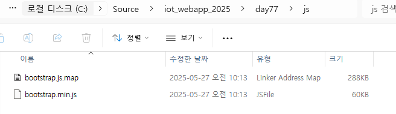

# iot_webapp_2025
iot 개발자 과정 ASP.NET Core 학습 리포지토리
### 이미지 참고 사이트
- [Placehold](https://placehold.co/)
- [Lorem Picsum](https://picsum.photos/)
- [LoremFlickr](https://loremflickr.com/)

## 74일차(5/22)
### Web
- 인터넷 상에 사용되는 서비스 중 하나
- 웹을 표현하는 기술 : HTML, XML의 경량화 버전
- 2014년 이후 HTML5로 적용되고 있음

### 웹 기술
- 웹 표준기술(프론트엔드) : HTML5(웹페이지 구조) + CSS3(디자인) + JavaScript6(인터렉티브)
- 웹 서버기술(백엔드) : ASP.NET Core (C#|VB) , SpringBoot(JAVA) , FLASK|DJANGO(PYTHON) , CGI(PHP, C) , Ruby...
- 웹 서비스 : 프론트엔드 + 백엔드
- 웹 브라우저 상에서 동작 : 현재는 웹 브라우저 상에서만 동작하는 경계가 사라졌음


#### HTML5
- 웹 페이지를 구성하는 언어(근간, 기본)
- HTML 상에서도 디자인을 할 수 있으나, 현재는 CSS로 분리

#### CSS 3
- 객체지향에 사용되는 부모자식 관계로 디자인 하는 기술
- 아주 쉬운 문법으로 구성됨

#### JavaScript
- 표준명 ECMAScript 2024
- Java와 전혀 관계없음. Java의 문법을 차용해서 사용한 웹 스크립트 언어
- 엄청난 발전을 이뤄 여러가지 기술로 분리
    - React.js, View.js 등의 프론트엔트 기술 언어로 분파
    - Node.js와 같은 웹 서비스기술에도 적용
    - VS Code 같은 개발도구를 만드는데도 사용
    - 3D 게임, 모바일 개발 등 다양한 분야에 사용

#### 웹 서버기술
- ASP.NET Core  : C#/VB언어로 웹 서버를 개발
- SpringBoot, Flask 등 다른 언어로 웹 서버를 개발해도 무방

#### 왜 웹을 공부해야하나?
- 스마트팩토리 솔루션ㅇ르 대부분 웹으로 개발(사용범위 제약을 없애기 위해서)
    - 웹 사이트, 일부분 모바일 앱 동시 개발
- 스마트홈(Iot) , ERP, 병원예약, 호텔예약, 인터넷뱅킹, 온라인서점...
- 모든 IT/ICT 개발에 웹 기술은 포함되어 있음

#### HTTP
- 웹을 요청/응답하는 프로토콜
- HTTPs : HTTP with secure . 보안 강화한 HTTP 프로토콜

### 웹 표준기술 학습
#### vs code 확장 설치
- `Live Server`

#### HTML 구조
- html 태그 내에 head, body로 구성
- README.md에도 HTML태그를 그대로 사용가능
- VS Code에서 html 적고 탭눌러서 html:5 자동생성
- css가 소스라인을 많이 사용. css는 외부스타일로 분리해서 사용 [(html)](./day74/html03.html) [(css)](./day74/html03.css)
- js도 소스라인이 매우 김. js도 외부스크립트로 분리 사용 [(html)](./day74/html03.html) [(js)](./day74/html03.js)
- 웹 브라우저의 개발자모드(F12)로 디버깅을 하는 것이 일반적


#### HTML 기본태그(body에 사용) [(html)](./day74/html04.html) [(html 입력태그)](./day74/html05.html)  [(다양한 입력방식)](./day74/html06.html) 
- h1~h6 : 제목글자
- p, br, hr : 본문, 한줄내려가기, 가로줄
- div : 영역구분
- a : 링크
- b/strong, i, small, sub, sup, ins/u, del  : 굵은체, 이탤릭체, 작은글씨, 아래첨자, 위첨자 ,밑줄, 삭제표시밑줄 ...
- ul/ol , li : 동그라미목록/순번목록, 목록아이템
- table, tr, th, td : 테이블, 테이블로우, 테이블헤더, 테이블컬럼
- form, input, button, select, textarea, label : 폼, 폼 입력양식, 버튼, 콤보박스, 여러줄텍스트박스, 라벨
- img , audio, video : 이미지, 오디오, 비디오
- progress : 진행률

#### 공간분할태그 [(div, span 태그)](./day74/html07.html) 
- div 사용 이전엔 table, tr, td로 화면 분할을 활용
- table을 여러번 중복하면 랜더링 속도 저하로 화면이 빨리 표시가 안됨
- 웹 기술표준을 적용해서 div 태그로 공간분할을 시작
- div를 css로 디자인 적용해서 랜더링 속도를 빠르게 변경
- 게시판 목록, 상세보기 등에서는 아직도 table을 사용중

1. div
-
2. span : 인라인 요소(inline element)로, 텍스트나 다른 인라인 요소의 일부를 감싸서 스타일을 적용하거나 자바스크립트로 조작
-

#### 시맨틱웹
- 웹구조를 좀더 구조적으로 세밀하게 구분짓는 의미로 만들어진 웹 구성방식
- 시맨틱 태그
    - header, nav, main, section, aside, article, footer
    - 기본 HTML 태그가 아니고, 필수도 아님
- 최근에는 잘 사용안함. div태그에 id를 부여해서 유사하게 사용 중
- div만 잘 쓰면 됨

### 웹 표준기술 -CSS  [(div태그에 css)](./day74/html08.html)
#### 개요
- 마크업 언어에 표시방법을 기술하는 종속형 시트(계단식 스타일시트)
- WPF는 CSS와 유사한 방식을 차용
- 문법
    ```css
    태크/아이디/클래스 {
        key : value ;  /*한줄주석은 안됨. 여러줄 주석만 됨*/
    }
    ```
- html 태그 속성
    - id :웹페이지 하나당 한번만 쓸 것 , **속성 #**
    - class : 여러번 사용가능 , **속성 .**
    ```html
    <head>
        <style>
            #header 
            {
                background-color: antiquewhite;
            }
            .temp
            {
                background-color: rgb(250, 215, 244);
            }
        </style>

    </head>

    <body>
        <div id="header">
            <h1>로고영역</h1>
        </div>
        <div id="nav" class="temp">
            <ul>
                <li>메일</li>
                <li>카페</li>
                <li>블로그</li>
                <li>스토어</li>
                <li>뉴스</li>
                <li>증권</li>
                <li>부동산</li>
            </ul>
        </div>
        <div id="container" class="temp">
             <div id="aside">
                <h3>aside</h3>
            </div>
            <div id="contents">
                <h3>contents</h3>
            </div>
        </div>
    </body>
    ```
    - 
- css 실습
    - margin: 0 auto; 주로 가로로 중앙 정렬을 할 때 사용됩니다.
    - float: left; 왼쪽으로 정렬하거나, 여러 요소들을 나란히 배치하고자 할 때 사용
    - 
- UI기술로 많은 분야에서 사용
    - Qt,  PyQt , Electron, Flutter(모바일), React Native(모바일), React.js ...

## 75일차(5/23)
- HTML, CSS, JS 는 "(쌍따옴표),'(홑따옴표) 동시 사용가능
- Python은 ''을 추천, 웹은 "" 추천

### 웹 표준기술 - CSS
- `style 태그 안에 주석은 /**/`
- css 학습 
    1. [후손선택자,반응선택자,속성선택자](./day75/html01.html)
    ```css
        /*아이디*/
        #wv {
                color : red;
            }
        /*클래스*/
        .item {
            color : rgb(95, 187, 87);
        }
        .focus {
            background-color: gray;
        }

        /*태그선택자 중 속성선택자*/
        input[type="text"] {
            background-color: antiquewhite;
        }
    ```
    2. [css p태그 글자크기](./day75/html02.html)
    3. [Margin, Padding, Border](./day75/html03.html)
    4. [레이아웃, 중앙정렬, 수평정렬](./day75/html04.html)
    ```css
    <style>
    * {
        margin :0 ;
        padding : 0 ;
    }
    body {
        margin: 0 auto;
        width: 800px;
    }

     /*수평정렬*/
    div.container {
        overflow: hidden;
    }

    div.item {
        float: left;
        margin: 0 5px;
        padding: 10px;
        border: 2px solid brown;
    }
    </style>
    ```
### 웹 표준기술 - JavaScript
- Java(컴파일러언어)와 아무런 관계없음
- 스크립트언어

#### 기본문법
- `script 태그 안에 주석은 //`
- HTML내에 script 태그 내에 작성

1. 키워드
    - 
2. **변수선언이 var(전역, 지역), let(지역)**
    - 변수타입 : 숫자, 문자열, 불린, ...
        - null : undefined
3. 문장 끝에 ; 생략이 가능하지만 되도록 적을 것
4. 출력확인
    - 디버깅 출력 : console.log()
    - 화면메시지박스 : alert()
5. 연산자 : 비교연산자, 수식연산자, 논리연산자 , ...
    - 차이점 : === (값과 타입이 완전 일치)
6. 제어 : if, while, for
7. 함수 : function

#### JavaScript 객체
- JSON : 자바스크립트 객체를 표현하는 방식
- 매우 편리하여 표준으로 지정하고 모든 IT분야에서 사용중
```js
  var dried_mango = {
            name : '7D Dried mangoes' ,
            manufacturer  : '7D Foods Corporation',
            weight : '500g',
            origin : 'Philippines',
            calories : 320
        }
        
        console.log(dried_mango);
        console.log(dried_mango.name);
        console.log(JSON.stringify(dried_mango));
        console.log(dried_mango["weight"])
```
1. `<head>` 안에 `<script>` 작성  [스크립트연습1](./day75/html05.html)
    - 스크립트가 문서 로딩 전에 반드시 실행되어야 할 경우

2. `<body>` 끝에 `<script>` 작성 (일반적으로 추천) [스크립트연습1](./day75/html06.html)
    - 대부분의 경우.
    - HTML 요소들이 모두 로딩된 후 스크립트를 실행해야 할 때.
    - DOM 조작 시 오류를 방지할 수 있음.
#### DOM 학습 [DOM학습1](./day75/html07.html)[ DOM학습2](./day75/html08.html)
- HTML문서의 구조를 JS에서 접근할 수 있는 개념
- HTML태그를 JS로 조작한다는 의미
- DOM에서 쓰이는 주요 함수들
    ```
        //1개 객체를 선택
        document.getElementById(아이디)
        document.querySelector(태그)

        //여러개 객체를 선택
        document.getElementsByName(이름)
        document.getElementsByClassName(클래스)
        document.querySelectorAll(선택자)
    ```
- DOM 학습
    1. 함수를 통한 css속성처럼 JS로 속성변경 및 속성GET
    ```js
    <script>
            function changeSentence() {
                /*
                css
                h1 {
                    background-color : red ;
                }

                JS속성
                backgroundColor : -를 제거하고 뒤쪽 단어를 대문자로 시작
                */
                
                document.querySelector("h1").style.backgroundColor = "#ff0000";
                document.querySelector("h1").style.color = "#ffffff";
                document.querySelector("p").style.color = "green";
                document.querySelector("p").style.fontStyle = "Italic";

                var value = document.querySelector("button");
                alert (value.getAttribute("onClick"));
                //value.setAttribute("속성", 변경할 값);
            }
    </script>

    <button onclick="changeSentence()">클릭</button>
    ```
    2.  document.querySelectorAll은 반복문
    ```js

        window.onload = function () {

            var temps = document.querySelectorAll("p");
            for (var i = 0 ;  i < temps.length ; i++)
            {   var temp =temps[i]
                temp.style.color = "orange";
            }
        }
    ```
    3. window_onload()함수 + 날짜시간형식 + innerHTML
    ```js
        window.onload =function(){
                    var clock = document.getElementById("clock");
                    setInterval(function() {
                        var now = new Date();
                        var format = new Intl.DateTimeFormat('sv-SE', {
                            dateStyle : 'short',
                            timeStyle : 'medium'
                        }).format(now);
                        clock.innerHTML = format;
                    }, 1000) ; //1000ms =>1초

        }

        <p id="clock"></p>
    ```
    4. 버튼이 아닌곳에 버튼 이벤트를 지정
    ```js
        window.onload =function(event){
                var link = document.getElementById("link");
                link.onclick= function (){
                    alert("창이 뜹니다.")
                    return true
                }
            }


        <a id="link" href="https://www.naver.com/" target="_blank">네이버</a>
    ```

#### jQuery [jQuery학습](./day75/html09.html)
- JavaScript DOM의 복잡한 사용법을 개선하려고 만든 라이브러리
- 2006년도 개발. 2023년까지 업데이트
- https://jquery.com/
- Vanila JS(순수 JS) 방식으로 변경되고 있음

- CDN 방식으로 사용
    ```html
    <script src="https://code.jquery.com/jquery-3.7.1.min.js" integrity="sha256-/JqT3SQfawRcv/BIHPThkBvs0OEvtFFmqPF/lYI/Cxo=" 
        crossorigin="anonymous"></script>
    ```
- 모든 DOM객체에 접근할 때 `$(선택자|아이디|클래스) 후 처리`
- jQuery 이벤트
    - .on('이벤트' , function(){}) 또는 funcion() {}
    - 
- jQuery학습
    1. $(태그)
        ```JS
        <script>
                // 문서가 준비되면 실행
                $(document).ready(function () {
                    $('h1').css('color', 'red');
                    $('h1').css('background-color' , 'yellow');
                });

                function makeGradient() {
                    let output ='';
                    for (let i = 0 ; i<256 ; i++)
                    {
                        output += "<div></div>";
                    }
                    $('body').html(output);
                    $('div').each(function(i) {
                        $(this).css ('height' , '2px');
                        $(this).css ('background-color' , `rgb(${i},${i},${i})`);
                    })
                }
            </script>
        ```
    2. 백틱문자 
        ```JS
        $(this).css ('background-color' , `rgb(${i},${i},${i})`);
        ```

    3. $(#아이디)
        ```js
        <script src="https://code.jquery.com/jquery-3.7.1.min.js" integrity="sha256-/JqT3SQfawRcv/BIHPThkBvs0OEvtFFmqPF/lYI/Cxo=" 
        crossorigin="anonymous"></script>
        <script>
            $(document).ready(function() {
                $('#btnEffect').on('click', function() {
                    alert('버튼클릭완료')
                })
            });
        </script>

        <button id="btnEffect">클릭</button>
        ```
    4. js파일을 따로 빼서 css, 이벤트 작성 [js파일](./day75/jquery10.js)
        ```js
        $(document).ready(function() {

        $('#box').css ({
        'background-color' : 'orange',
        'width' : 100,
        'height' :100,
        'margin' : '5px'
        }).on('click' , function() {
            $(this).css('background-color' , 'red')
        }).on('mouseenter' , function() {
            $(this).css('background-color' , 'blue')
        }).on('mouseleave' , function() {
            $(this).css('background-color' , 'orange')
            $(this).css('border-radius' , '0')

        })
        });
        ```
    5. 애니메이션 , 토글 [js파일](./day75/jquery10.js)
####  Vanila JS
- 순수 JS로 불리며 JQuery처럼 CDN링크가 필요없음
- 전통적 방식보다 효율적으로 변경됨
- 새로 개발되는 웹사이트는   Vanila JS를 사용   
## 76일차(5/26)
### 반응형웹
- UTF-8이 적용되기 전 : 한국어 웹, 영어 웹, 일본어 웹 등 웹페이지를 언어별로 개발해야 함
- 반응형 웹 이전 : PC용, 모바일용, 태블릿용 등 따로 웹 사이트를 개발해야 함
- 문제 : 하나의 웹페이지가 수정되면 다른 웹페이지들도 다 수정해야함 ->시간, 돈 많이 든다.
- 하나의 웹페이지로 기기, 언어문제를 전부 해결하고자 나온 기술 중 화면쪽 -> 반응형 웹
-  반응형 웹 : 웹 , 모바일 등의 기기와 해상도에 상관없이 하나의 웹으로 모두 표현할 수 있는 웹화면 개발 기술
- **HTML5에 반응형 웹 메타태그만 사용**
    ```html
    <head>
        <!--반응형 웹 중요태그-->
        <meta name="viewport" content="width=device-width, initial-scale=1.0">
    </head>
    ```
    - 부트스트랩 학습 https://inpa.tistory.com/category/Style%20Sheet/Bootstrap5?page=2

### 부트스트랩
- 현재 전세계적으로 가장 많이 사용되는 오픈소스 CSS,JS 프레임워크
- 트위터 블루프린트로 시작. 트위터 웹사이트를 꾸미기 위해서 개발시작
- 현재 5.3 버전
- 이전에는 jQuery 사용했으나 현재는 Pure JS로 전향되었음
- [공식사이트](https://getbootstrap.com/)

#### 부트스트랩 시작 
- Bootstrap 시작하기 가이드 :  https://getbootstrap.com/docs/5.3/getting-started/introduction/#quick-start
- [Bootstrap 시작 실습](./day76/html01.html)
    - css와 js를 html파일에 복사붙여넣기 
    - 실행결과, 글꼴이 바뀜
    - 
#### 부트스트랩 학습
- 버튼 사용법[버튼+미디어쿼리 실습](./day76/html01.html)
    ```html 
    <input type="button" value="Primary" class="btn btn-outline-primary btn-sm">
    ```
     - 
- 미디어 쿼리 : 웹페이지 사이즈에 따른 사용법을 위해 필요
    - 부트스트랩에서 sm, md, lg 등의 infix를 사용할 경우가 많음
    - X-Small : None(사용할 이름이 없음) (<576px)
    - Small : sm (>=576px)
    - Medium : md (>=768px)
    - Large : lg (>=992px)
    - Extra large : xl (>= 1200px)
    
- 컨테이너 : 기본 레이아웃에서 가장 중요! . 그리드 스타일이라고 부름
    - [container](./day76/html02.html) : 일반적인 넓이 사용. 양쪽에 여백이 존재 .중앙 정렬 + 고정 너비
    - container-fluid : 여백없이 웹페이지를 꽉채우는 스타일 .전체 너비 
    - 
    - `container > row > col 형식으로 사용`
    - [각 grid은 최대 12까지 사용 권장](./day76/html03.html)
- 정렬 클래스 [정렬](./day76/html04.html)
    - *별 : start, center, end
    - text-*
    - align-self-*
    - align-itmes-*
    - justify-content-*
    - [정렬 이미지 참고](https://inpa.tistory.com/entry/BootStrap5-%F0%9F%93%9A-%EB%B0%98%EC%9D%91%ED%98%95-%EC%8B%9C%EC%8A%A4%ED%85%9C-%EC%A0%95%EB%A6%AC-%EC%A0%95%EB%A0%AC)
- 거터 : 갭(안쪽여백) , padding과 동일 [거터](./day76/html04.html)
    - g, gx, gy, g-number, gx-number, gy-number
    - number : 1부터 5까지 사용가능
    - g = gx + gy
    - gx : 왼쪽, 오른쪽 안 여백
    - gy : 위쪽, 아래쪽 안 여백
- 여백을 위한 클래스   [여백](./day76/html04.html)
    - number : 1부터 5까지 사용가능
    - p, ps, pt, pb, pe, px, py  : padding
    - m, ms(left), mt, mb, me(right), mx, my : margin
    - start, top, end, bottom : 배율로 조정
- 컴포넌트 학습 [accordion, alert, buttonBox, Badge 등](./day76/html05.html)
    - Acoordion
    - Alert : Button 클래스와 동일 primary ~light(link는 없음)
    - Breadcrumb :메뉴경로
    - Navbar, Navs & tabs : 메뉴 내비게이션바
    - Button, Close button, Button group : 버튼관련 컴포넌트
    - Card, Placeholders, Popovers, Toasts, Tooltips : 화면 영역 컴포넌트
    - Pagination : 게시판 페이지 컴포넌트
    - Progress, Spinners : 프로그레스바, 대기용 컴포넌트
    - Carousel :  이미지 갤러리
- 아이콘
    - `https://icons.getbootstrap.com/`
    - 부트스트랩이 지원해주는 아이콘
    - python pyqt, leaflet.js(folium) 등에도 사용가능
    - 추가 스타일시트 링크 필요(css)
    ```html
    <!--부트스트랩 아이콘-->
    <link rel="stylesheet" href="https://cdn.jsdelivr.net/npm/bootstrap-icons@1.13.1/font/bootstrap-icons.min.css">
    <i class="bi bi-alarm"></i>
    ```


https://github.com/user-attachments/assets/afb6c357-ebf5-45ca-8d58-e0cc5819f0bb

#### [부트스트랩 이미지 갤러리](./day76/html06.html)


#### 부트스트랩 템플릿 사이트
- 유료 템플릿
    - [wrapbootstrap](https://wrapbootstrap.com/templates)
    - [themeforest](https://themeforest.net/search/sns%20bootstrap)
    - [themewagon](https://themewagon.com/theme-price/free/) 

- 무료 템플릿
    - [startbootstrap](https://startbootstrap.com/) : 무료템플릿 중 최고
    - [bootswatch](https://bootswatch.com/)
    - [themewagon](https://themewagon.com/theme-price/free/)
    - [bootstrapmade](https://bootstrapmade.com/) : 출처표기 필수!
    - [graygrids](https://graygrids.com/templates?type=free)

## 77일차(5/27)
### 프론트엔드 활용
- HTML5 + CSS3 + JS + BootStrap 반응형웹 응용예제  [반응형 갤러리 게시판 실습](./day76/html06.html)
    - 

#### HTML5 Responsive Web template
- https://html5up.net/

#### Modern Business 클로닝
- Modern Business 샘플 클로닝
    - https://startbootstrap.com/template/modern-business
1. 모든 웹페이지 시작은 index.*(.html, .asp, .jsp, .cshtml...)
2. 폴더 구성 (css, assets, js) , index.html
3. assets폴더에 아이콘 favicon.ico 생성
4. Bootstrap 다운로드 후 폴더에 구성(not CDN-CSS, JS코드 넣지 않고 직접 다운로드함)
    - https://getbootstrap.com/docs/5.3/getting-started/download/ 에서 컴파일된 CSS 및 JS 다운로드 (bootstrap-5.3.6-dist)
    - js폴더에 압축폴더에서 찾아서 넣기
    - 
    - css폴더에 압축폴더에서 찾아서 넣기
    - 

5. Bootstrap 아이콘 다운로드 후 폴더에 구성
    - https://github.com/twbs/icons/releases/tag/v1.13.1 에서 bootstrap-icons-1.13.1 다운로드
    - css폴더에 압축폴더에 있는 fonts폴더채로 넣기
    - https://github.com/twbs/icons/blob/main/font/bootstrap-icons.css 에서 다운로드
    - 
6. index.html 디자인,태그 내에 Bootstrap 클래스 적용 [index.html](./day77/index.html)
    - 태그 내에 Bootstrap 클래스 적용
    ```
    body
    ├── div#main
    │   ├── div#nav
    │   ├── div#header
    │   ├── div#features
    │   ├── div#testimonial
    │   └── div#blog_section
    └── div#footer
    ```
7. contact.html 디자인,태그 내에 Bootstrap 클래스 적  [contact.html](./day77/contact.html)
8. 테마 [index.html](./day77/index.html)
    - jquery.js , popper.js 다운받아서 js폴더에 넣기
    - https://code.jquery.com/jquery-3.7.1.min.js 
    - https://cdn.jsdelivr.net/npm/@popperjs/core@2.11.8/dist/umd/popper.min.js
    - 테마 버튼 코드 및 js코드
    ```html
    <head>
        <!--jquery js-->
        <script src="./js/jquery-3.7.1.min.js"></script>
        <script>
            $(document).ready(function(){
                //테마작업
                $('#btnLight').addClass('active')  ;//기본 테마는 라이트
                $('#blog_section').css({
                    'background-color' : 'rgba(240,240,240,0.2)'
                })  ;


                $('#btnLight').on('click', function(){
                    $('html').attr('data-bs-theme', 'light');
                    $('#btnDark').removeClass('active');
                    $('#btnLight').addClass('active');
                    $('#iconTheme').attr('class','bi bi-brightness-high-fill');
                    $('#blog_section').css({
                    'background-color' : 'rgba(240,240,240,0.2)'
                    })  ;
                });

                $('#btnDark').click( function(){
                    $('html').attr('data-bs-theme', 'dark');
                    $('#btnLight').removeClass('active');
                    $('#btnDark').addClass('active');
                    $('#iconTheme').attr('class','bi bi-moon-stars-fill');
                    $('#blog_section').css({
                    'background-color' : 'rgba(66,66,66,0.5)'
                    })  ;
                });
                
            })
        </script>
    </head>
    <body class="d-flex flex-column h-100">
        <!-- 오른쪽아래 바닥 테마변경 아이콘영역 -->
        <div class="dropdown position-fixed bottom-0 end-0 mb-3 me-3 bd-mode-toggle theme-menu">
            <button class="btn btn-primary py-2 dropdown-toggle d-flex align-items-center" 
                    data-bs-toggle="dropdown" id="bd-theme" type="button">
                <i id="iconTheme" class="bi bi-brightness-high-fill"></i>
            </button>
            <ul class="dropdown-menu">
                <li>
                    <button id="btnLight" type="button" class="dropdown-item d-flex align-items-center"
                            data-bs-theme-value="light" aria-pressed="true">
                        <i class="bi bi-brightness-high-fill"></i>&nbsp;Light
                    </button>
                </li>
                <li>
                    <button id="btnDark" type="button" class="dropdown-item d-flex align-items-center"
                            data-bs-theme-value="dark" aria-pressed="false">
                        <i class="bi bi-moon-stars-fill"></i>&nbsp;Dark
                    </button>
                </li>
            </ul>
        </div>

        <!--popper js-->
        <script src="./js/popper.min.js"></script>

        <!--js-->
        <script src="./js/bootstrap.min.js"></script>
    </body>
    ```
## 78일차(5/28)


### ASP.NET Core